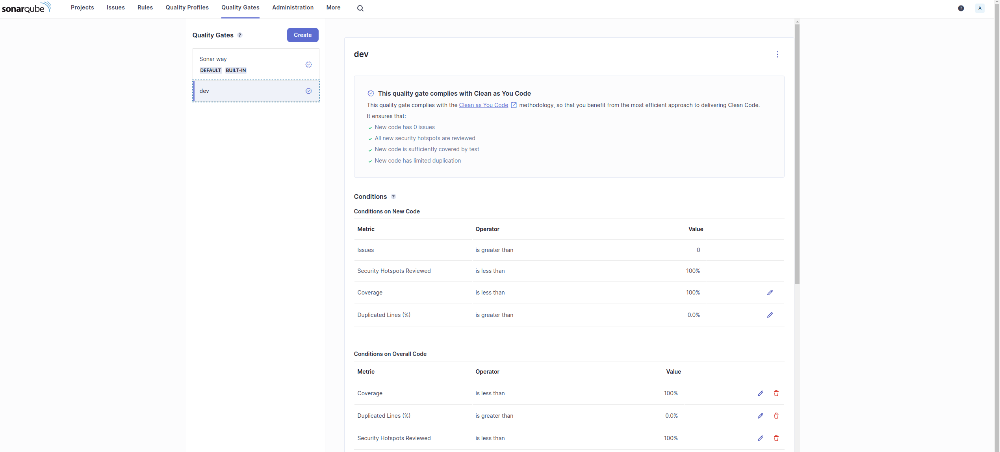
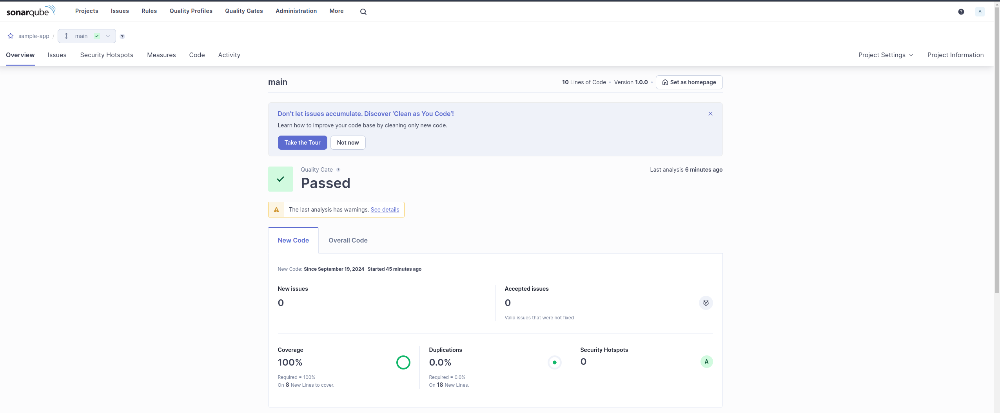
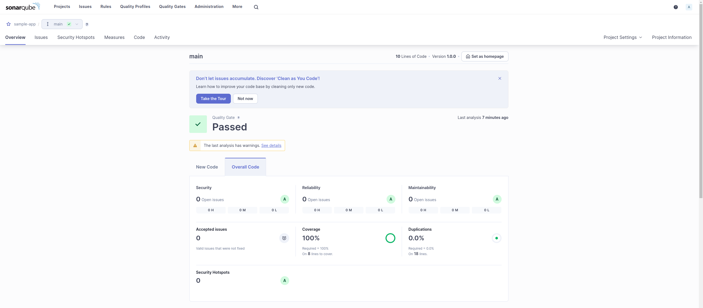

# sonarcli
A command-line tool to make sonar execution, scans and setups easier


## Table of Content
* [Fatures](#fatures)
* [Project Structure](#project-structure)
* [Languages Supported](#languages-supported)
* [Getting started](#getting-started)
* [Installation](#installation)
* [Use mode](#use-mode)
* [Uninstallation](#uninstallation)


## Fatures
- [x] User creation
- [x] Project creation
- [x] QualityGate creation
- [x] Run sonarqube via docker
- [x] Wait for sonar to be ready
- [x] Run sonar-scanner via docker


## Demo Results
<details>
  <summary>Quality Gate</summary>


</details>

<details>
  <summary>New Code</summary>


</details>


<details>
  <summary>Overall Code</summary>


</details>


## Project Structure
```
├── requirements-dev.txt
├── requirements.txt
└── src
    └── sonarcli.py
```


## Languages Supported
- [x] python
- [ ] golang
- [ ] node


## Getting started
Before the installation make sure that you already have created the files bellow in your project
- [sonar-project.properties](example/sonar-project.properties)
- [sonar-qualitygate.json](example/sonar-qualitygate.json)


## Installation
``` shell
git clone git@github.com/aleroxac/sonarcli.git && cd sonarcli
make install
```


## Use mode
``` shell
cd sonarcli/examples/python
make install
make test
sed -i "s|<source>${PWD}/src<\/source>|<source>/usr/src/src</source>|g" coverage.xml

sonar run
sonar wait
sonar setup sample-app | jq > sonar.json
sonar scan
```


## Uninstallation
``` shell
make uninstall
```
